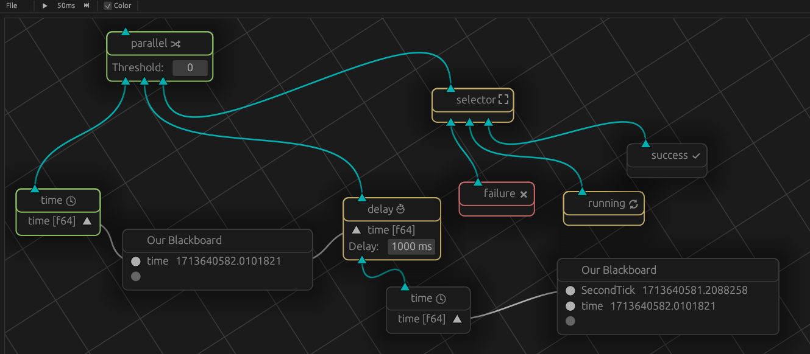

# Betula



This is a [behaviour](https://en.wikipedia.org/wiki/Behavior_tree_(artificial_intelligence,_robotics_and_control)) [tree](https://en.wikipedia.org/wiki/Birch) library.
It is created with the goal of automating a computer game, but the library itself should work for other use cases.

# Architecture

Overview of the crates in this workspace. Crates with nodes provide the `UiNode` implementation if the `betula_editor` feature is enabled.

Nodes are categorised into:
- Action: Nodes that perform an action: Pressing a key.
- Conditionals: Make a decision, usually based on a blackboard value and optionally internal state, often used as decorator: Checking if a window is focussed, add delay between executions.
- Control: Nodes that merely affect control flow: Selector node.
- Decorators: Decorators: Nodes that must be used as a decorator: Change return value, retry up to a duration.
- Providers: Provides blackboard value: Clock, screen capture, etc.

## betula_core
- Holds the traits for `Node` and `Tree`.
- The `basic` module holds the standard (non-event) implementation for a blackboard and a tree.
- Holds helpers for `Port`s and `BlackboardValue`.

## betula_common
Main components:
- `TreeSupport` to allow type-erased serialization and deserialization of the tree state (into/from `serde`).
- Control protocol to manipulate a tree.
- Server thread to allow running a tree in the background.

## betula_editor
A gui built on [egui](https://github.com/emilk/egui).

- Uses the control protocol from `betula_common`.
- `UiNode` trait that must be implemented for `Node`s to provide editor support.
- `BetulaViewer`, backed by [egui-snarl](https://github.com/zakarumych/egui-snarl).
- `UiSupport` that allows registering new nodes.
- `Editor`, an `eframe::App` that can be instantiated.
- `UiNode` implementation for `betula_common` and `betula_core`.
- Also provides ui support for the nodes from `betula_core`.
- Shift+drag to (de)select nodes, selected nodes can be moved together.

Nodes' directory is set to the directory in which the current tree file resides. This is considered the `PROJECT` directory, there can of course
be multiple `json` files in the root of this directory, reusing assets in the project directory.

## betula_demo
- Application that instantiates an editor with all nodes that exist in the workspace.

## betula_std
A collection of standard nodes, that don't have any additional dependencies.

#### Nodes
  - `TimeNode`: Write the unix time to a blackboard as `f64`.
  - `DelayNode`: Delays execution of the child node with the specified interval.

Control:
  - `ParallelNode`: A node that executes all children and determines status based on their return.
  - `SelectorNode`: Executes in order, returns first non-`Failure`.
  - `SequenceNode`: Executes in order, returns first non-`Success`.

Decorators:
  - `SuccessNode`: Always returns `Success`, may be a decorator.
  - `RunningNode`: Always returns `Running`, may be a decorator.
  - `FailureNode`: Always returns `Failure`, may be a decorator.


## betula_enigo
Betula nodes for [enigo](https://crates.io/crates/enigo): `Cross platform input simulation in Rust`.

- `EnigoInstanceNode`: Provides an `Enigo` instance to the blackboard.
- `EnigoCursorNode`: Provides the position of the cursor to the blackboard.
- `EnigoNode`: Sends `Enigo::Token` to the `Enigo` instance to simulate events. 

The `EnigoNode` can load presets from files.
- All `toml` files in the `PROJECT/enigo_node/` directory are parsed.
- Filename is ignored.
- Tables can be used to specify where in the preset menu the entry exists.
- Modifying the actions that are shown when a preset is selected decouples from the preset, but keeps the actions.

For example:
```toml
[GameMenu.Difficulty.Normal]
description="Click Normal difficulty."
actions = [
    {MoveMouse = [950, 450, "Abs"]},
    {Button = ["Left", "Click"]}
]
```
This preset will create a preset named `Normal` in the `GameMenu`'s `Difficulty` submenu. This preset
contains two actions, an absolute mouse move to `950,450`, followed by a left mouse button click.

The actions are a list of [enigo::Token](https://docs.rs/enigo/latest/enigo/agent/enum.Token.html) entries.

## betula_wm
Pertains itself to information obtained from the window manager.

  - `WindowFocusNode`: Returns `Success` if the regex matches the binary that created the window that has focus.
  - `CursorPositionNode`: Provides the cursor position.

## betula_hotkey
Facilitates detecting hotkeys (without the editor being focussed).
For x11, this relies on the [global_hotkey](https://crates.io/crates/global-hotkey) crate.
On Windows, this uses a self-built low level hook, such that it can detect events without blocking them.

  - `HotkeyInstanceNode`: Provides an `Hotkey` instance for registering hotkeys.
  - `HotkeyNode`: Returns `Success` if the hotkey is depressed or toggled.


## betula_image
Provides the `Image` blackboard type, which is effectively an `Arc<crate::RgbaImage>`, so copying them is cheap and they can be kept around. 


### ImageCaptureNode
This facilitates capturing (parts) of the screen on both Windows and Linux. It produces `Image` values when executed. The actual capturing happens in a background thread that runs independently of the tree.

It uses my [screen_capture](https://github.com/iwanders/screen_capture) crate, which efficiently captures the
desktop's framebuffer (including fullscreen applications). The framebuffer is `BGRA` format, but this is efficiently
converted to `RGBA`, which allows using the `image::RgbaImage` as a data type. This crate and the `screen_capture`
crate are best compiled with `rustflags='-C target-feature=+avx2'` which ensures they utilise SIMD instructions for
the color space conversion.

The outputs `capture_time` and `capture_duration` are optional.


### ImageMatchNode
This node can match a pattern against an input image. Checking against a pattern happens when the node is executed, as such make the patterns as minimal as possible. This node returns `Success` if the pattern matches, `Failure` otherwise.

This node may be a decorator, in which case it returns `Failure` if the pattern doesn't match, or the child node's return if it does.

- Patterns are read from the the `PROJECT/image_match/` directory.
- Subdirectories may exist, their name is used as submenu entry.
- Patterns must be `png` images, for example `masked_Screenshot407.png`.
- The image dimensions must *exactly* match the input image dimensions.
- Transparent pixels in the pattern are ignored in the input image.
- A pattern matches if all non transparent pixels in the pattern are identical in the input image.
- A sidecar `toml` file (`masked_Screenshot407.toml`) may exist with the following keys:
  - `name`: Used as a display name in the ui, and used for sorting.
  - `description`: Used for mouseover in the ui.

The `image_pattern` example can be used to create patterns quickly, (multiple) segments can be specified with `x,y,length`:
```
cargo r --example image_pattern -- create --output-dir Game/Left/ ${SCREENSHOTS}/Screenshot518.png  0,95,150 319,154,178  --filename cube --name "Cube" --description "The horadric cube is shown in the left panel."
```
The `image_pattern_match` example can be used to verify all files in the `image_match` directory load correctly.

# Capture, cursors and coordinates.

In my setup, I have two 1080p monitors side by side, with the right monitor being the primary monitor in windows.

- Windows:
  - Top left corner of the right monitor is cursor position 0,0.
  - Bottom right corner of the right monitor is 1919,1079. 
  - Top left corner of left monitor is -1919,0.
- Linux:
  - Top left corner of the right monitor is cursor position 1920,0.
  - Bottom right corner of the right monitor is 3839,1079. 
  - Top left corner of left monitor is 0,1079.

## Normalisation
So to get platform agnostic capture & cursor coordinates for complete right monitor;

- Capture configuration has one rule with:
  - `match_width: 3840`  This ensures it only matches on linux.
  - `x_offset: 1920`
  - `width: 1920`
  - `height: 1080`
- Enigo Instance:
  - Delta Linux: `1920, 0`, Delta Windows: `0,0`

With this all cursors are expressed in the right monitor coordinate frame, and the right monitor is the only image captured.


# License
License is [`BSD-3-Clause`](./LICENSE).
