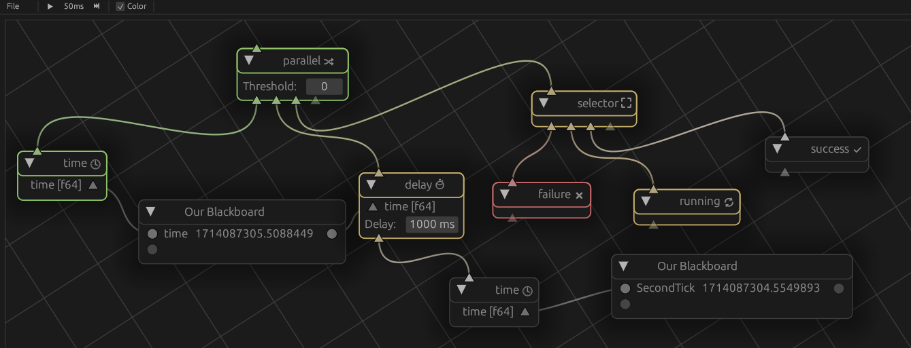

# Betula

This is a [behaviour](https://en.wikipedia.org/wiki/Behavior_tree_(artificial_intelligence,_robotics_and_control)) [tree](https://en.wikipedia.org/wiki/Birch) library.
It is created with the goal of automating a computer game, but the library itself should work for other use cases.

# Crates

Overview of the crates in this workspace. Crates with nodes provide the `UiNode` implementaiton if the `betula_egui` feature is enabled.

## betula_core
- Holds the traits for `Node` and `Tree`.
- The `basic` module holds the standard (non-event) implementation for a blackboard and a tree.
- Holds helpers for `Port`s and `BlackboardValue`.

## betula_common
Main components:
- `TreeSupport` to allow type-erased serialization and deserialization of the tree state (into/from `serde`).
- Control protocol to manipulate a tree.
- Server thread to allow running a tree in the background.

## betula_egui
- Uses the control protocol from `betula_common`.
- `UiNode` trait that must be implemented for `Node`s to provide editor support.
- `BetulaViewer`, backed by [egui-snarl](https://github.com/zakarumych/egui-snarl).
- `UiSupport` that allows registering new nodes.
- `Editor`, an `eframe::App` that can be instantiated.
- `UiNode` implementation for `betula_common` and `betula_core`.
- Also provides ui support for the nodes from `betula_core`.

## betula_demo
- Application that instantiates an editor with all nodes that exist in the workspace.

## betula_std
A collection of standard nodes, that don't have any additional dependencies.

#### Nodes
  - `TimeNode`: Write the unix time to a blackboard as `f64`.
  - `DelayNode`: Delays execution of the child node with the specified interval.

Control:
  - `ParallelNode`: A node that executes all children and determines status based on their return.
  - `SelectorNode`: Executes in order, returns first non-`Failure`.
  - `SequenceNode`: Executes in order, returns first non-`Success`.

Decorators:
  - `SuccessNode`: Always returns `Success`, may be a decorator.
  - `RunningNode`: Always returns `Running`, may be a decorator.
  - `FailureNode`: Always returns `Failure`, may be a decorator.

## betula_enigo
Betula nodes for [enigo](https://crates.io/crates/enigo): `Cross platform input simulation in Rust`.

  - `EnigoInstanceNode`: Provides an `Enigo` instance to the blackboard.
  - `EnigoNode`: Sends `Enigo::Token` to the `Enigo` instance to simulate events. 

## betula_wm
Pertains itself to information obtained from the window manager.

  - `WindowFocusNode`: Returns `Success` if the regex matches the binary that created the window that has focus.
  - `CursorPositionNode`: Provides the cursor position.

## betula_hotkey
Facilitates detecting hotkeys (without the editor being focussed).
For x11, this relies on the [global_hotkey](https://crates.io/crates/global-hotkey) crate.
On Windows, this uses a self-built low level hook, such that it can detect events without them being blocked.

  - `HotkeyInstanceNode`: Provides an `Hotkey` instance for registering hotkeys.
  - `HotkeyNode`: Returns `Success` if the hotkey is depressed or toggled.

# License
License is [`BSD-3-Clause`](./LICENSE).
